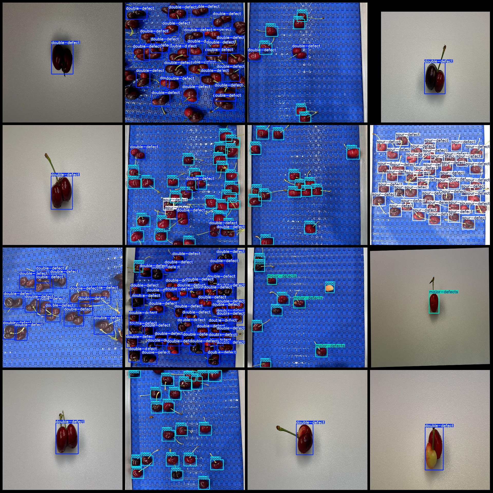
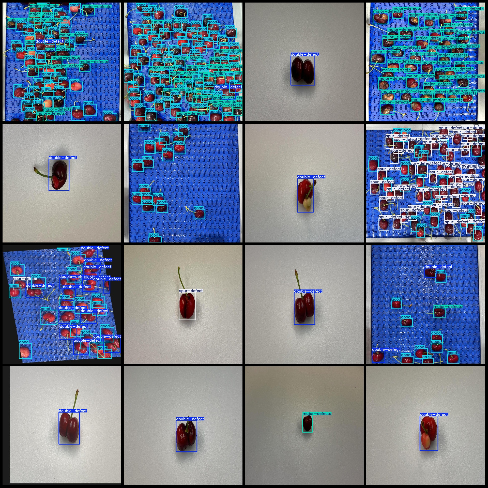

# Caramel Citrus Quality Inspection Defect Detection Dataset in VOC + YOLO format with 792 images in 4 categories

```
# Cherry Quality Inspection Defect Detection Dataset VOC+YOLO format with 792 images for 4 categories

Dataset format: Pascal VOC format + YOLO format (txt file without split path, only containing jpg images and corresponding VOC format xml files and YOLO format txt files)
Number of images (jpg file count): 792
Number of annotations (xml file count): 792
Number of annotations (txt file count): 792
Number of annotation categories: 4
Annotation category names (notice that the order of categories in the YOLO format does not correspond with this, but is based on the labels folder's classes.txt): ["double-defect", "good", 
"major-defects", "spur-defect"]
Number of boxes per category:
double-defect (dual defect) boxes = 3124
good (qualified product) boxes = 5555
major-defects (major defects) boxes = 3742
spur-defect (spur defects/flaw defects) boxes = 3054
Total number of boxes: 15475
Number of images per category:
double-defect (dual defect) images = 441
good (qualified product) images = 278
major-defects (major defects) images = 305
spur-defect (spur defects/flaw defects) images = 132
Image resolution: 960x960
Annotation tool used: labelImg
Annotation rules: draw boxes for categories
Important note: The dataset does not have been divided into training, validation, and test sets; please divide it yourself.
Special declaration: This dataset does not guarantee any accuracy of the trained models or weight files.
Image preview:
Annotation example:
```
## Images





Here is a pay link on Stripe ( https://buy.stripe.com/3cs8yP7sY87d0vu9AB ). Please contact me lonlonago@foxmail.com after funding $89, and I will send you a complete data files , thank you!


